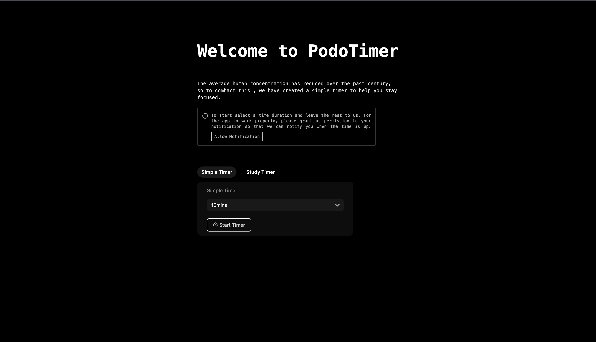

# STUDY TIMER

This project is a study timer to help improve concentration, i did it as a result of my need to focus while reading. I built it using just plain react js with typescript without any framework. It was built with the intention of being simple and easy to use
Despite it being a simple app, i plan on adding some more features in the v2 coming soon, this is a list of some of the planned features.
 - sound notification when timer is complete
 - user would be able to choose either to play cool classical music while study or not.
 - For the study time -  I want to play a music to signify the start and end of break time.
 - user should be able to choose and customise study time


## Screenshots




## Run Locally

Clone the project

```bash
  git clone https://link-to-project
```

Go to the project directory

```bash
  cd my-project
```

Install dependencies

```bash
  npm install
```

Start the server

```bash
  npm run dev
```

